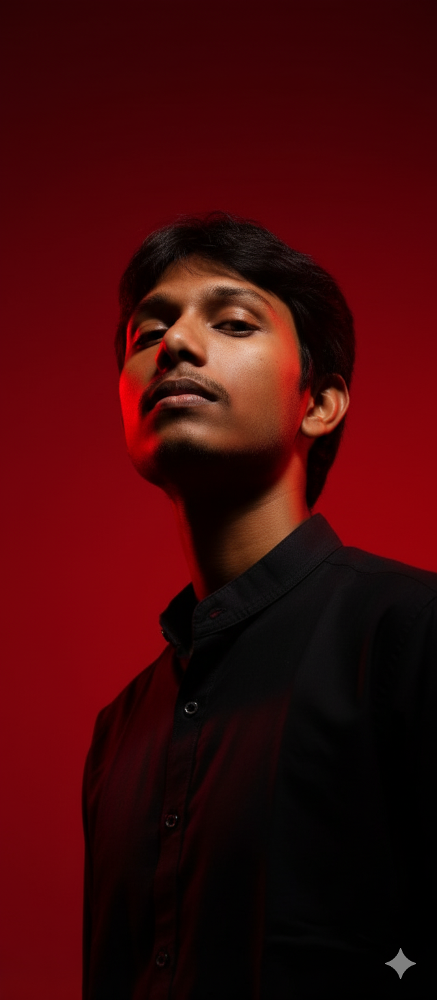
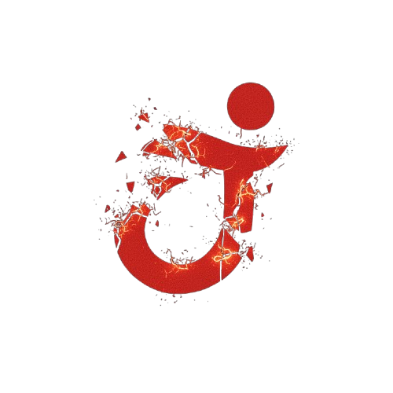

**I Gladly Welcome You**

  

    Profile Views: 694
    <h1 style="margin:0; font-size:2.5rem; color:#FF0000; font-family:'Fira Code', monospace;">Kedhareswer</h1>
    <h2 style="margin:0; font-size:1.35rem; color:#FF0000; font-family:'Fira Code', monospace;">GEN AI / DEVELOPER / DATA ENGINEER </h2>
    
I design and build <strong>intelligent systems</strong> and <strong>human-centered interfaces</strong>, crafting intelligence with code, building tomorrow's AI solutions, and transforming data into impact.

  

  

    
  

  <a href="https://naa-peru.vercel.app/" style="color:#FF0000; text-decoration:none; font-weight:600;">Explore Portfolio</a>
  •
  <a href="https://github.com/Kedhareswer?tab=repositories" style="color:#FF0000; text-decoration:none; font-weight:600;">View Projects</a>
  •
  <a href="https://www.kaggle.com/kedhareswernaidu" style="color:#FF0000; text-decoration:none; font-weight:600;">Kaggle Profile</a>

## 🛠️ Technology Arsenal

 

<table>
<tr>
<td align="center" width="100">

 <strong>Python</strong>
</td>
<td align="center" width="100">

 <strong>PyTorch</strong>
</td>
<td align="center" width="100">

 <strong>TensorFlow</strong>
</td>
<td align="center" width="100">

 <strong>TypeScript</strong>
</td>
<td align="center" width="100">

 <strong>React</strong>
</td>
<td align="center" width="100">

 <strong>Next.js</strong>
</td>
</tr>
</table>

**Machine Learning** • **Data Science** • **Full-Stack Development** • **Cloud Computing**

## 📊 Performance Analytics

 

### 🏆 **GitHub Achievements**

  

### 📈 **Contribution Stats**
<table>
<tr>
<td align="center">

</td>
<td align="center">

</td>
</tr>
</table>

---

## Research Interests

 

| Medical AI | Bioinformatics | LLM Systems | MLOps |
| --- | --- | --- | --- |
| Deep learning applications in healthcare and medical imaging analysis | Gene function prediction and genomic data analysis using ML | Advanced RAG architectures and prompt optimization techniques | Scalable ML pipeline design and intelligent deployment strategies |

---

## 🌟 Connect & Collaborate

**"Where Data Science Meets Innovation"**

*Passionate about creating AI solutions that bridge complex data with real-world impact*

**Open to collaboration on groundbreaking AI research and innovative projects**

 

