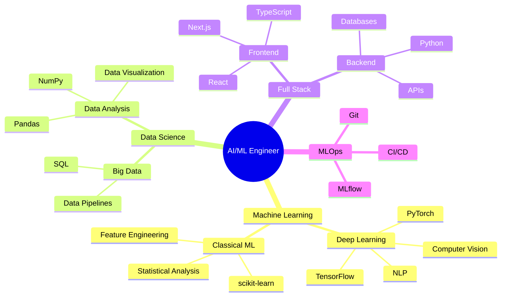

<h1 align="center">Hi 👋, I'm Kedhareswer</h1>
<h3 align="center">Data Scientist & AI/ML Engineer</h3>

  

  
  
  
  

## 🧠 Featured Projects

### 🔬 AI & Machine Learning
| Project | Description | Tech Stack | Status |
|---------|-------------|------------|---------|
| [ML_Projects](https://github.com/Kedhareswer/ML_Projects) | Comprehensive collection of ML experiments and research |   |  |
| [Endoscopy-Image-Enhancement](https://github.com/Kedhareswer/Endoscopy-Image-Enhancement) | Medical imaging enhancement using deep learning |   |  |

### 🤖 LLM & RAG Applications
| Project | Description | Tech Stack | Demo |
|---------|-------------|------------|------|
| [QuantumPDF_ChatApp](https://github.com/Kedhareswer/QuantumPDF_ChatApp) | Advanced RAG-based PDF analysis with multiple LLM support |   |  |
| [platform-prompt-alchemy-lab](https://github.com/Kedhareswer/platform-prompt-alchemy-lab) | AI prompt engineering & optimization platform |   |  |
| [RAG_HuggingFace](https://github.com/Kedhareswer/RAG_HuggingFace) | RAG implementation with Hugging Face models |   | Private |

### 🌐 Web Applications
| Project | Description | Tech Stack | Demo |
|---------|-------------|------------|------|
| [NaaPeru](https://github.com/Kedhareswer/NaaPeru) | Professional portfolio website |   |  |
| [interactive-periodic-table](https://github.com/Kedhareswer/interactive-periodic-table) | Interactive periodic table visualization |   |  |
| [Voice_Search](https://github.com/Kedhareswer/Voice_Search) | Voice-enabled search interface |   | In Development |

### 🔧 Developer Tools
| Project | Description | Tech Stack | Status |
|---------|-------------|------------|---------|
| [Synth_Data_Generator](https://github.com/Kedhareswer/Synth_Data_Generator) | Synthetic data generation tool |  | Private |

## 💻 Technical Skills

### Machine Learning & AI

### Data Science

### Web Development

### DevOps & Tools

## 🗺️ Skills Map

## 📊 GitHub Statistics

  

  

  

## 🔬 Research Interests
- Deep Learning in Medical Imaging
- Large Language Models & RAG Systems
- Computer Vision Applications
- Prompt Engineering & Optimization
- Full-Stack AI Applications

## 🤝 Let's Connect

---

  
📫 **Contact:** For collaboration on AI/ML projects or research opportunities, reach out via [Portfolio](https://naa-peru.vercel.app/) or [LinkedIn](https://linkedin.com/in/YOUR_LINKEDIN)

⭐ From [Kedhareswer](https://github.com/Kedhareswer)

> Last Updated: 2025-06-06 20:19:37 UTC

> Note: View all 58 repositories on my [GitHub profile](https://github.com/Kedhareswer?tab=repositories)
