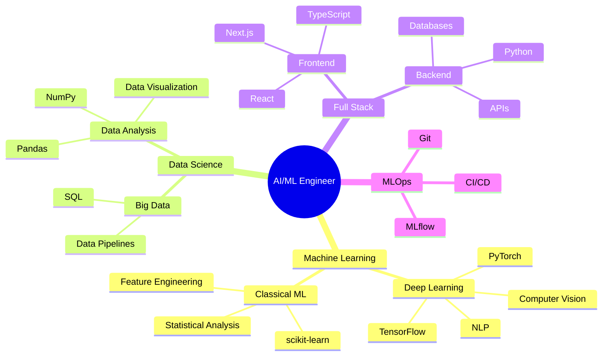

<h1 align="center">Hi 👋, I'm Kedhareswer</h1>
<h3 align="center">Data Scientist & AI/ML Engineer</h3>

  

  

  
  

## 🧠 Featured Projects

### 🔬 AI & Machine Learning
| Project | Description | Tech Stack | Status |
|---------|-------------|------------|---------|
| [ML_Projects](https://github.com/Kedhareswer/ML_Projects) | Collection of Jupyter notebooks covering various ML experiments and research |   | Active |
| [MLGeneFunction](https://github.com/Kedhareswer/MLGeneFunction) | Machine learning approach for gene function prediction |   | Active |

### 🤖 LLM & RAG Applications
| Project | Description | Tech Stack | Status |
|---------|-------------|------------|---------|
| [QuantumPDF_ChatApp](https://github.com/Kedhareswer/QuantumPDF_ChatApp) | Advanced RAG-based PDF analysis platform with multi-LLM support |   | Active |
| [platform-prompt-alchemy-lab](https://github.com/Kedhareswer/platform-prompt-alchemy-lab) | AI prompt engineering platform with advanced techniques |    | Active |

### 📊 Data Science & Analytics
| Project | Description | Tech Stack | Status |
|---------|-------------|------------|---------|
| [Data_Science_Platform](https://github.com/Kedhareswer/Data_Science_Platform) | Modern data analysis platform with interactive notebook interface |   | Active |
| [ai-project-planner](https://github.com/Kedhareswer/ai-project-planner) | AI-powered project planning and management tool |   | Active |

### 🌐 Web Applications
| Project | Description | Tech Stack | Status |
|---------|-------------|------------|---------|
| [NaaPeru](https://github.com/Kedhareswer/NaaPeru) | Professional portfolio website with modern design |   | Active |
| [My_Portfolio_Designs](https://github.com/Kedhareswer/My_Portfolio_Designs) | Collection of portfolio design variations |   | Active |

## 💻 Technical Skills

### Machine Learning & AI

### Data Science

### Web Development

### DevOps & Tools

## 🗺️ Skills Map

## 📊 GitHub Statistics

  

    
  

  
  
  
  
  
  

## 🔬 Research Interests
- Deep Learning in Medical Imaging
- Large Language Models & RAG Systems
- Computer Vision Applications
- Prompt Engineering & Optimization
- Full-Stack AI Applications
- Data Platform Development
- AI Project Management
- Gene Function Prediction
- Interactive Data Visualization

## 🤝 Let's Connect

---

  
📫 **Contact:** For collaboration on AI/ML projects or research opportunities, reach out via [Portfolio](https://naa-peru.vercel.app/) or [LinkedIn](https://linkedin.com/in/YOUR_LINKEDIN)

⭐ From [Kedhareswer](https://github.com/Kedhareswer)

> Last Updated: 2025-06-18 03:22:30 UTC

> Note: View all repositories on my [GitHub profile](https://github.com/Kedhareswer?tab=repositories)
